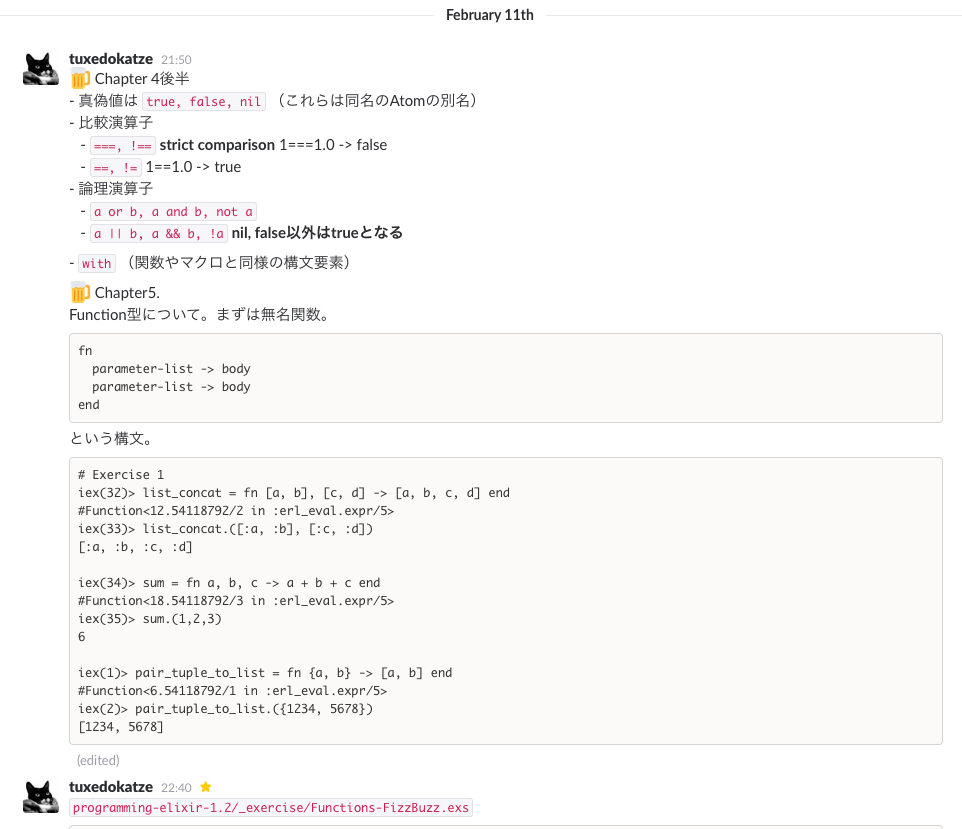
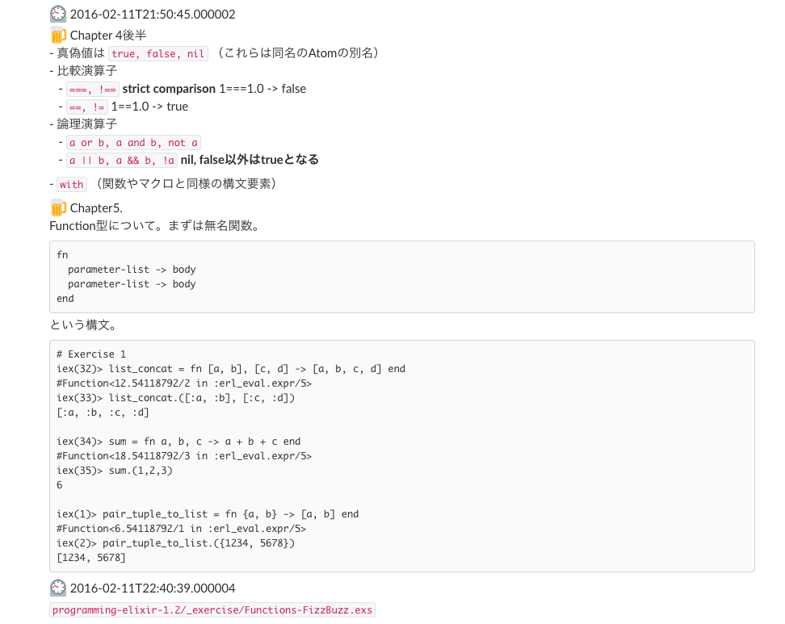

# slackmover

A tiny silly script to...

* retrieve and archive messages as json file (works for both public/private channels)
* copy messages from private to public channel in a quite-dumb way


## Requirements
* Python 3.5.1
  * because this uses type hinting (certainly not necessary, just out of curiosity)
* pip installable packages
  * slackclient
  * click (cli parser)

## Usage
You'll need Slack API token.

```sh
# --help to show CUI help
./slackmover.py --help
```

```sh
# subcommand: archive
# example: retrieve messages in "dev" channel and save as json file
./slackmover.py archive dev --token $(cat slacktoken.txt)
```

```sh
# subcommand: mirror
# example: copy messages in private channel to public channel
#          this will just post messages with additional time-stamp messages
./slackmover.py mirror __dev__ dev --token $(cat slacktoken.txt)

```

### Result (mirror)
src: private channel (`__dev__`)


dest: public channel (`dev`)


## License
```
The MIT License (MIT)
Copyright (c) 2016 tuxedocat@github.com

Permission is hereby granted, free of charge, to any person obtaining a copy of this software and associated documentation files (the "Software"), to deal in the Software without restriction, including without limitation the rights to use, copy, modify, merge, publish, distribute, sublicense, and/or sell copies of the Software, and to permit persons to whom the Software is furnished to do so, subject to the following conditions:

The above copyright notice and this permission notice shall be included in all copies or substantial portions of the Software.

THE SOFTWARE IS PROVIDED "AS IS", WITHOUT WARRANTY OF ANY KIND, EXPRESS OR IMPLIED, INCLUDING BUT NOT LIMITED TO THE WARRANTIES OF MERCHANTABILITY, FITNESS FOR A PARTICULAR PURPOSE AND NONINFRINGEMENT. IN NO EVENT SHALL THE AUTHORS OR COPYRIGHT HOLDERS BE LIABLE FOR ANY CLAIM, DAMAGES OR OTHER LIABILITY, WHETHER IN AN ACTION OF CONTRACT, TORT OR OTHERWISE, ARISING FROM, OUT OF OR IN CONNECTION WITH THE SOFTWARE OR THE USE OR OTHER DEALINGS IN THE SOFTWARE.
```
